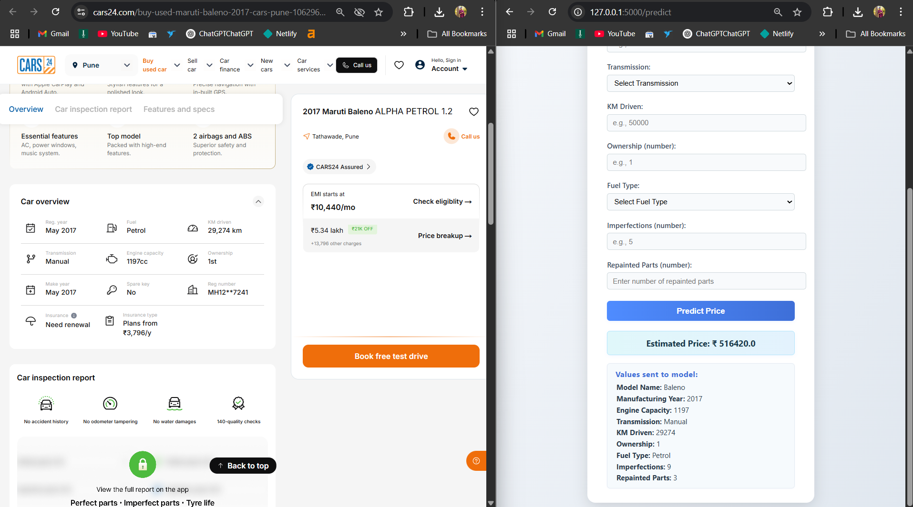

# 🚗 Used Car Price Prediction with Random Forest

This project showcases a Machine Learning-based system for **predicting the resale value of used cars** using a **Random Forest Regressor**. It enables users to estimate a fair market price for a used car based on specifications like make, model, usage, and physical condition.

## 📌 Key Features

- 🔍 Accurate price prediction using real-world car data
- ✅ Interactive and user-friendly web interface built with **Flask**
- 🌲 Robust model trained using **Random Forest Regression**
- 📊 Considers important factors such as:
  - Model Name
  - Year of Manufacture
  - Engine Capacity
  - Transmission Type
  - KM Driven
  - Ownership History
  - Fuel Type
  - Number of Repainted Parts
  - Number of Imperfections

## 🛠 Tech Stack

- **Python**
- **Scikit-learn**
- **Pandas & NumPy**
- **Flask**
- **HTML/CSS (Jinja2 Templates)**

## 🚀 How to Run the Project

### 1. Clone the repository

https://github.com/Omiiii1221/used-car-price-prediction.git
cd used-car-price-prediction

### 2. Install the dependencies

pip install -r requirements.txt

### 3. Run the Flask application

python app.py

### 4. Open in browser

Visit [http://127.0.0.1:5000](http://127.0.0.1:5000) to use the app.

## 📈 Model Accuracy

The model achieves high accuracy with minimal difference between predicted and actual market prices.
Example:

| Source       | Price (₹) |
| ------------ | --------- |
| Cars24       | 5,34,000  |
| Model Output | 5,16,420  |

## 📂 Folder Structure

used-car-price-prediction/
│
├── static/               # CSS/JS/Images
├── templates/            # HTML templates
├── app.py                # Flask app
├── model.joblib             # Trained Random Forest model
├── preprocess.py         # Data preparation
├── requirements.txt      # Python dependencies
└── README.md             # Project info

## 📄 License

This project is licensed under the [MIT License](LICENSE).

## 👨‍💻 Author

**Gaikwad Om**
